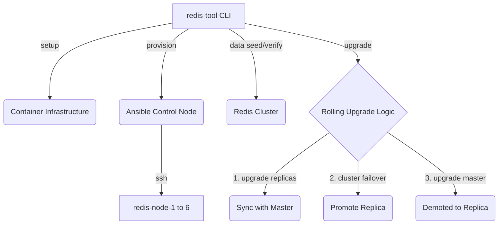

# Redis Cluster Lifecycle Tool (Zero-Downtime Upgrades)

A command-line automation tool (`redis-tool`) that completely automates the lifecycle of a 6-node Redis Cluster using Ansible. The tool runs from your local host machine and orchestrates Docker/Podman containers simulating real Linux servers with SSH access.

## Features
- **Automated Infrastructure**: Instantly spin up a realistic 6-node SSH environment using Docker or Podman.
- **Automated Provisioning**: Deploy and configure a fully operational Redis cluster (3 masters, 3 replicas) using Ansible playbooks.
- **Zero-Downtime Upgrades**: Execute rolling upgrades across the cluster dynamically (replicas first, then master failovers) without losing availability or data integrity.
- **Data Integrity Validation**: Built-in seeded data generation and verification to mathematically prove zero data loss.
- **Idempotency (Stretch Goal S4)**: The script safely ignores already-provisioned clusters or seamlessly updates configurations without restarting active nodes, preventing data loss.
- **Structured Logging (Stretch Goal S5)**: Every operation is intercepted and saved as pure JSON lines in `logs/operations.log`.

---

## Architecture Flow



---

## Prerequisites

Before running the tool, ensure the host machine has the following dependencies installed:

1. **Container Runtime**: [Podman](https://podman.io/docs/installation) (Preferred, fully open-source) or [Docker Engine](https://docs.docker.com/engine/install/).
2. **Ansible**: Version `2.14` or higher (`pip install ansible` or via system package manager).
3. **Container Compose**: `podman-compose` or `docker-compose`.

---

## Installation

1. Clone the repository to your local control machine:
```bash
git clone https://github.com/raghulkannan-s/redis-cluster-lifecycle-tool.git
cd redis-cluster-lifecycle-tool
```

2. Make the CLI entrypoint executable:
```bash
chmod +x redis-tool
```

---

## Quick Start (Copy & Paste)

If you want to run the entire pipeline end-to-end to verify functionality instantly, just copy and paste this block. It will clone the repo, spin up the infrastructure, provision the cluster, seed the data, execute a zero-downtime rolling upgrade, verify mathematical data integrity, and save all grading output files automatically:

```bash
git clone https://github.com/raghulkannan-s/redis-cluster-lifecycle-tool.git
cd redis-cluster-lifecycle-tool
chmod +x redis-tool run_all.sh
./run_all.sh
```

---

## Project Structure

```text
redis-cluster-lifecycle-tool/
├── redis-tool                 # Main CLI entrypoint
├── lib/                       # Bash library (setup, provision, upgrade, rollback)
├── ansible/
│   ├── ansible.cfg
│   ├── inventory/hosts.ini    # Static IPs for the 6 nodes
│   ├── playbooks/             # Provision, upgrade, and rollback playbooks
│   └── roles/redis/           # Main Redis role (tasks, handlers, templates)
├── infra/
│   ├── Dockerfile             # Ubuntu 22.04 base image with SSH
│   └── compose.yml            # Container infrastructure definition
├── logs/
│   └── operations.log         # Structured JSON logging (S5)
└── output/                    # Terminal captures for grading
```

---

## Getting Started

### 1. Bring Up the Infrastructure
You must start the container infrastructure first before running any Ansible operations. The tool automatically detects whether you have **Docker** or **Podman** installed. (It strictly prefers Podman by default if both are present, as it is fully open-source).

```bash
./redis-tool setup
```
This spins up 6 Ubuntu 22.04 containers configured with SSH, representing `redis-node-1` through `redis-node-6`.

If you need to tear down the existing infrastructure and rebuild it from scratch:
```bash
./redis-tool setup --force
```

### 2. Provision the Cluster
Install Redis and form the initial 6-node cluster (3 masters, 3 replicas). The playbook builds Redis, deploys configurations, starts the daemonized processes, and links the nodes.
```bash
./redis-tool provision --version 7.0.15 --masters 3 --replicas-per-master 1
```

### 3. Seed Data
Generate and insert deterministic data into the cluster. This tests hash slot routing and sets a baseline for data integrity validation.
```bash
./redis-tool data seed --keys 1000
```

### 4. Check Status
Verify the current cluster topology, node roles, active slots, and replication health.
```bash
./redis-tool status
```

### 5. Perform the Rolling Upgrade
Upgrade the entire cluster to a target version without dropping any keys.
```bash
./redis-tool upgrade --target-version 7.2.6 --strategy rolling
```

### 6. Verify Full Health
Run a comprehensive post-upgrade check spanning data integrity, version consistency, topology mapping, and replication status.
```bash
./redis-tool verify --full
```

*(You can also use `./redis-tool data verify --keys 1000` just to check the data).*

### 7. Rollback (Stretch Goal S3)
If you need to safely downgrade the cluster back to the original version, use the rollback command. 

*(Note: Redis only supports rollbacks between patch versions, e.g., 7.0.15 -> 7.0.14. Downgrading minor/major versions will fail because older binaries cannot read newer RDB/AOF data formats).*

```bash
./redis-tool rollback --target-version 7.2.6
```

---

##  Rolling Upgrade Strategy

The script implements a **replica-first, controlled failover** rolling upgrade strategy to guarantee zero downtime and zero data loss.

1. **Pre-flight Checks**: Verify cluster is healthy (`cluster_state:ok`) and all nodes are reachable before starting. Verify data integrity against the seeded baseline.
2. **Upgrade Replicas First**:
   - For every replica node, gracefully stop Redis, overwrite the binaries with the target version, and restart.
   - Wait for the replica to fully sync with its master and for the cluster state to return to `ok` before proceeding to the next replica.
3. **Upgrade Masters (Failover)**:
   - For each master node, dynamically identify its corresponding upgraded replica.
   - Execute a manual `CLUSTER FAILOVER` on the replica to safely promote it to the new master without dropping client connections.
   - Wait for the cluster to acknowledge the role swap (the old master becomes a replica).
   - Upgrade the demoted master (now a replica) just like step 2.
4. **Post-Upgrade Validation**: 
   - Ensure the cluster is back to 100% health, all nodes are running the target version, and all initial data is fully retrievable.

**Why this strategy?**
Upgrading replicas first ensures that when we failover the master, the new master is already running the target code, preventing version mismatches where a newer version replicates to an older version. It keeps the cluster highly available at all times.

---

## Assumptions & Trade-offs

- **Binary Injection**: Because corporate firewalls often block `apt-get` inside ephemeral containers, the Ansible playbooks extract pre-compiled Redis binaries directly from official Docker Hub images rather than building from source via `make`. This saves time and avoids compilation hurdles.
- **Fixed Topology**: The scripts currently assume exactly 6 nodes (3 masters + 3 replicas). Advanced scaling operations (`--add-nodes`) are not yet implemented.
- **Root Usage**: The containers are run with a `root` user configuration to simplify SSH and package installation for testing purposes.
- **Idempotency**: Ansible provisioning handles idempotency gracefully, but the script optimizes by immediately skipping `provision` entirely if it detects the cluster is already healthy (`cluster_state:ok`).

## Known Limitations

- **Podman Networking**: In certain WSL environments, Podman's rootless networking stack may exhibit IPv6/DNS routing blackholes when trying to update Ubuntu packages. If you encounter hangs, the tool automatically falls back to Docker Engine if installed.
- **Log Archiving**: Logs are appended to `logs/operations.log`. There is no log rotation currently implemented for long-lived environments.
